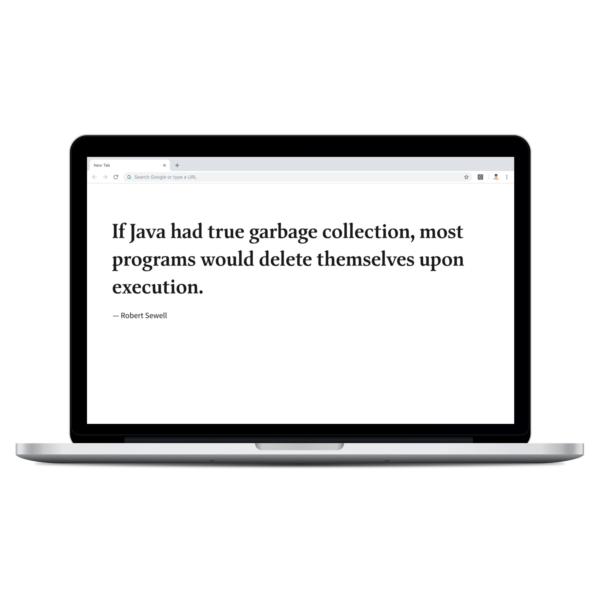

# Coder Quotes

Coder quotes is a simple chrome extension which will show Programming Quotes when you open a new tab in Chrome Browser

### What is Chrome App ?
A Google Chrome App is a web application that runs on the Google Chrome web browser. Chrome Apps let you use HTML5, CSS, and JavaScript to deliver an experience comparable to a native application
## Step 1 - Getting started
Download or clone this repository

`git clone  https://github.com/ajithvgiri/coder_quotes.git`

## Step 2 - Installation

Open your chrome browser go to **Settings -> Extentions** enable **Developer Mode** and click on **Load unpacked** and browse the downloaded/cloned project location

## Step 3 - Download
[Download]:(https://bit.ly/codequotes)
